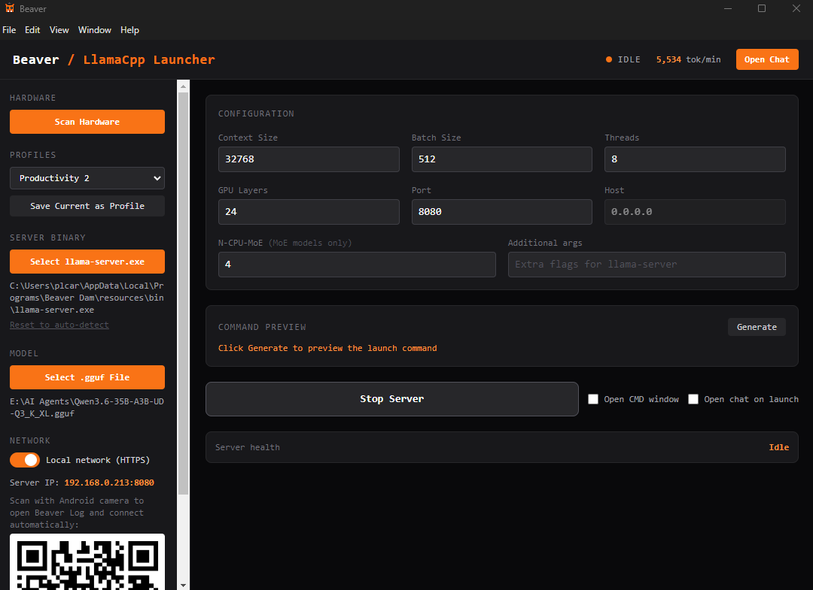
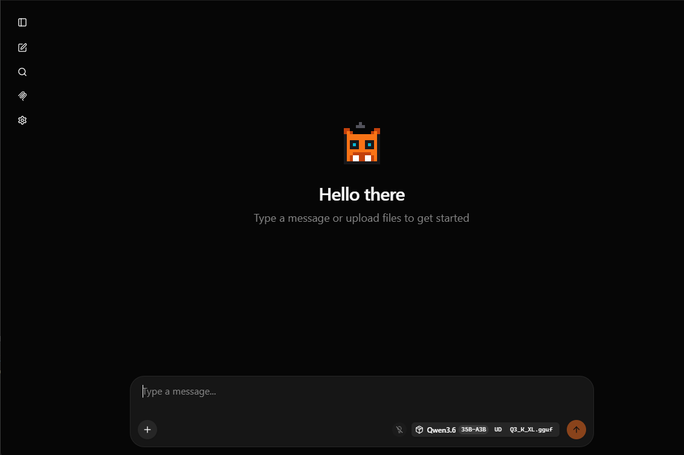

<p align="center">
  
</p>

# Beaver

**A local LLM ecosystem for home/office use.** Run a model on your PC to use it as a coding agent or chat with it from any device on your home network — phone, laptop, or another desktop — with no cloud, no subscriptions, and no data leaving your house.

---

## Contents
- [Mission](#mission)
- [What Is Beaver?](#what-is-beaver)
- [How It Works](#how-it-works)
- [Web Tools](#web-tools)
- [Using as a Coding Agent](#using-as-a-coding-agent-kilo-code--continue-etc)
- [Tested Configuration](#tested-configuration)
- [Requirements](#requirements)
- [Installation](#installation-end-users)
- [Development Setup](#development-setup)
- [Building Installers](#building-installers)
- [Roadmap](#roadmap)
- [Alternatives](#alternatives-worth-knowing-about)
- [Acknowledgements](#acknowledgements)

---

> **AI Assistance Disclosure**
> This project was built with significant help from [Claude Code](https://claude.ai/code) (Anthropic). The architecture, design decisions, and goals are the author's own. The implementation was a collaborative process between the author and an AI coding assistant. This is disclosed upfront because it is honest, not because it is something to hide.

---

## Screenshots

| Beaver Dam — server launcher | Chat UI |
|---|---|
|  |  |

---

## Origin

Beaver Dam started as a personal frustration fix. Running llama.cpp meant remembering and typing out long command-line arguments every time — model path, context size, GPU layers, port, host. I wanted a UI where I could save those settings and hit a button.

The primary use case was a **local coding agent**: point Kilo Code (or any OpenAI-compatible coding extension) at a locally running model and have a capable AI assistant that works without a subscription and never sends code off-device. Everything else — the Android app, the QR code, the Windows client — grew from wanting that same server accessible on my phone from the couch.

The privacy angle is not an afterthought. My background is in social work, where you routinely handle information that genuinely should not leave the room. The idea of pasting case notes or client details into a cloud AI product is uncomfortable but workloads in the field are often challenging making tools like llm workflows for documentation helpful. Running a model locally means the data stays on the machine — no API calls phoning home, no training pipeline, no terms of service to read carefully or settings to change.

I named it beaver in part because of how much it relies on llama and because a beaver builds a dam which felt like a fitting metaphor for keeping your AI use contained.

---

## Mission

Cloud AI services are priced to create dependency. A tool starts accessible, workflows get built around it, and then pricing changes — because it can. OpenAI, Microsoft Copilot, Google Gemini have all adjusted tiers, changed what's included, or shifted terms of service since launch. A small organization that builds its operations around any of them has no leverage and no guarantee those costs are stable next year.

Beaver's answer to that is simple: **own the hardware, run free software, pay once.**

A gaming PC with a capable GPU is a capital expense. It depreciates, but you own it. The model weights are a file you download. The software is open source. Nothing about any of that changes next year because a company decided to restructure its pricing.

**The liability problem is concrete, not abstract.**

For individuals and organizations in regulated fields, the question isn't just cost — it's whether cloud AI can be used at all without professional exposure:

- **Social work** — client confidentiality is a licensing requirement. Information leaving your network, even to a "secure" third-party service, is a legally uncomfortable position depending on jurisdiction.
- **Legal** — attorney-client privilege attaches to communications. Routing client details through a third-party API creates privilege questions most attorneys don't want to litigate.
- **Healthcare-adjacent** — HIPAA business associate agreements exist for this reason. Most cloud AI providers don't offer them outside enterprise tiers small organizations can't afford.
- **Education** — FERPA covers student records. Same problem.

For these organizations the question isn't "is cloud AI convenient?" It's "can we use it without liability?" For many the honest answer is no, or not without legal review they also can't afford.

**Local AI removes that question entirely.** If the data never leaves the building, there is no transmission, no third-party, no terms-of-service clause to parse. The model runs on your hardware. Your data stays on your hardware.

**Why open source matters here specifically.**

Beyond cost, open source software can be audited. In regulated industries that matters — you can verify what the software does and doesn't send. It can't be discontinued by a vendor decision. It can't be acquired and repriced. It doesn't lock you into a relationship with a company that may not exist in five years.

**The hardware case for small organizations.**

Grants fund capital expenditures. A purpose-built AI server is a line item in a capital grant application — something a foundation or government program can fund once. A recurring SaaS subscription competes with salaries and direct services every year and is harder to justify to funders.

The long-term goal of this project — a **Beaver Box**, a dedicated appliance that sits in the office and just works — is designed around this reality. A single hardware purchase, free software, zero ongoing cost. Staff on any device connect to it the way they'd connect to a printer. That's the shape a solution needs to take for a 6-person social work agency, a small legal aid clinic, or a community health provider that genuinely cannot afford enterprise AI and genuinely cannot send client data to the cloud.

The project isn't there yet. But that's the direction.

---

## What Is Beaver?

Beaver is a small ecosystem of apps built around [TurboQuant+](https://github.com/TheTom/llama-cpp-turboquant), a production-grade fork of [llama.cpp](https://github.com/ggerganov/llama.cpp) that adds advanced weight and KV-cache quantization. The core idea: your home PC probably has a GPU capable of running a decent LLM locally. Beaver makes it easy to start a model on that PC and reach it from any device on your home network.

There are three components:

| App | Platform | Role |
|---|---|---|
| **Beaver Dam** | Windows (Electron) | Server manager — loads and runs the model, broadcasts its location on the LAN |
| **Beaver Log** | Android (Capacitor) | Mobile client — scans for Beaver Dam automatically, or connect via QR code |
| **Beaver Log** | Windows (Electron) | Desktop client — same chat UI as Android, for connecting from another PC |

All three share the same [SvelteKit](https://kit.svelte.dev/) chat frontend, which is a modified fork of the upstream llama.cpp web UI.

---

## How It Works

```
[ GPU PC ]                          [ Phone / Laptop / VS Code ]
  Beaver Dam                           Beaver Log  /  Kilo Code
  ├─ llama-server (TurboQuant+)     ├─ Scans LAN on port 8765
  ├─ Tool gateway (:port+1)         ├─ Finds Beaver Dam automatically
  ├─ Beacon on :8765                └─ Or connect manually to http://IP:8080
  └─ Chat UI + OpenAI API :8080
```

**Discovery:** Beaver Dam broadcasts a JSON beacon on port 8765. Beaver Log (both Android and Windows) scans the local subnet on startup and connects automatically if a running server is found. No configuration required.

**QR Connect:** Beaver Dam displays a QR code in the UI when network mode is on. Scanning it with the Android camera opens Beaver Log and connects to the server in one tap via a `beaver://connect` deep link.

**OpenAI-compatible API:** llama-server exposes `/v1/chat/completions` and related endpoints, so any tool that accepts a custom OpenAI base URL can use Beaver Dam as its backend — including coding agents, scripts, and API clients.

**Browser access:** When Beaver Dam is running, the chat UI is also accessible directly in any browser at `http://127.0.0.1:8080` (or `http://<LAN-IP>:8080` in network mode). No app required.

**HTTP only:** The LAN connection uses plain HTTP. HTTPS with self-signed certificates was tried and abandoned — Android WebView rejects them without manual cert trust, which is too much friction for a home tool. Proper transport security is on the roadmap, likely via a lightweight CA or certificate pinning approach, and becomes more important as the project moves toward small business use.

---

## Web Tools

Beaver Dam includes an optional web fetch tool that lets the model look up live content from approved sources during a conversation — Wikipedia, GitHub, AP News, legal references, arXiv, PubMed, and others. This is off by default and saved per profile.

**How it works:** When web tools are enabled, Beaver Dam starts a lightweight gateway proxy on the port adjacent to llama-server (e.g. `:8081` when the server runs on `:8080`). The beacon advertises this gateway port so clients connect through it automatically. When the model decides to look something up, it calls `web_fetch`, the gateway fetches the page, strips it to plain text, injects the result back into context, and the model continues. If no tools are enabled the gateway is a pure transparent proxy with no overhead.

**The whitelist is enforced at the gateway, not the client.** Because the gateway sits on the server machine rather than the client device, no connected user — and no prompt — can make the model fetch from a source that isn't on the approved list. A law firm might approve only the specific legal databases their practice relies on, scoped to their local jurisdiction. Large models can conflate laws from different states when synthesizing across multiple sources; a whitelist restricted to one jurisdiction's databases reduces that risk at the source rather than relying on the model to keep track of it. The model cannot be instructed to go outside that boundary regardless of what a user asks it to do.

The built-in source groups (General Knowledge, Developer, News, Legal US, Research) are proof-of-concept defaults — starting points that demonstrate what a group looks like. In practice, an organization would define their own groups from the sources they actually trust and control. That precision is the point.

**Configuring tools in Beaver Dam:**

The **Web Tools** card appears in the main configuration panel, between the model settings and the command preview. From there you can enable built-in source groups, toggle individual sources, create custom groups, add your own URLs to the whitelist, and set the per-fetch token budget. All settings are saved with the active profile — different profiles can have different tool configurations.

**Performance note:** Each tool call adds 2–5 seconds of latency. The model's response appears after all fetches complete. Context sizes below 8192 tokens are flagged with a warning since fetched content competes with your conversation history. Beaver Dam shows a red warning below 4096 tokens where tool use is likely to break the context entirely.

**Custom sources:** User-defined tools and groups are stored in `tools.json` in the Electron userData directory alongside `profiles.json`. Built-in sources are proof-of-concept defaults and can be toggled off per-profile.

---

## Using as a Coding Agent (Kilo Code / Continue / etc.)

Since llama-server speaks the OpenAI API, any coding extension that accepts a custom base URL works out of the box.

**Kilo Code (VS Code extension):**
1. Open VS Code → Kilo Code settings
2. Set **API Provider** to `OpenAI Compatible`
3. Set **Base URL** to `http://127.0.0.1:8080/v1` (or your LAN IP if connecting from another machine)
4. Set **API Key** to any non-empty string (llama-server ignores it, but most clients require the field)
5. Set **Model** to the name of your loaded model (e.g. `Qwen3.6-35B-A3B-UD-Q3_K_XL`)

The same pattern applies to [Continue](https://continue.dev/), [Aider](https://aider.chat/), or any tool with OpenAI-compatible configuration.

---

## Tested Configuration

This is the hardware and model used during development. Results will vary by GPU, quantization level, and task type.

| | |
|---|---|
| **CPU** | AMD Ryzen 7 7700X |
| **GPU** | NVIDIA RTX 3060 12 GB |
| **RAM** | 32 GB DDR5 |
| **Model** | [Qwen3.6-35B-A3B-UD-Q3_K_XL](https://huggingface.co/unsloth/Qwen3.6-35B-A3B-GGUF) |
| **Speed** | ~25–30 tokens/sec on light coding tasks and summarization |

**The model:** Qwen3.6-35B-A3B is an Alibaba model with a hybrid Gated DeltaNet and Gated Attention architecture, 256 experts with 8 routed and 1 shared active at a time — totalling ~3B active parameters out of 35B. That's why it fits and runs at useful speed on a 12 GB card that would be completely unusable with a dense 35B model.

**The quantization:** The `UD` prefix stands for Unsloth Dynamic — [Unsloth AI](https://huggingface.co/unsloth) applies different quantization levels to different layers intelligently rather than a flat bit-depth across the whole model. This gives meaningfully better output quality at the same file size compared to a standard K-quant. Credit to Unsloth for the conversion and for making this model accessible in GGUF format.

### Finding GGUF Models

The easiest source is [Hugging Face](https://huggingface.co). For the model above:

> **[unsloth/Qwen3.6-35B-A3B-GGUF](https://huggingface.co/unsloth/Qwen3.6-35B-A3B-GGUF)**

Unsloth provides multiple quantization variants. The `UD-Q3_K_XL` tested here fits comfortably in 12 GB of VRAM. Higher quantizations (Q4 and above) are available if you have more VRAM or are willing to offload some layers to system RAM.

[Unsloth](https://huggingface.co/unsloth) and [bartowski](https://huggingface.co/bartowski) are both reliable sources for well-quantized GGUF files across many model families.

---

## Requirements

### Beaver Dam (server)
- Windows 10/11
- A GPU with at least 6 GB VRAM (NVIDIA recommended; llama.cpp supports CUDA and Vulkan)
- A GGUF model file

### Beaver Log Android
- Android 10 or later
- On the same Wi-Fi network as the Beaver Dam PC

### Beaver Log Windows
- Windows 10/11
- On the same network as the Beaver Dam PC (or on the same machine)

---

## Installation (End Users)

### Beaver Dam
1. Download `Beaver Dam Setup 1.0.0.exe` from [Releases](../../releases)
2. Run the installer — Windows Defender may warn about an unsigned binary, click **More info → Run anyway**
3. Open Beaver Dam, point it at a `.gguf` model file, and click **Start Server**
4. Turn on **Local network** mode to make the server reachable from other devices

### Beaver Log (Android)
1. Download `beaver-chat-ui.apk` from [Releases](../../releases)
2. On your phone, allow installation from unknown sources (Settings → Apps → Special app access → Install unknown apps)
3. Install the APK
4. Open the app — it scans automatically, or scan the QR code in Beaver Dam to connect

### Beaver Log (Windows)
1. Download `Beaver Log Setup 1.0.0.exe` from [Releases](../../releases)
2. Install and open — it scans your local network automatically and connects if Beaver Dam is running
3. If auto-scan doesn't find the server, open **Settings** in the app and enter the server address manually (e.g. `http://192.168.0.213:8080`)

> **Note:** The initial release of Beaver Log Windows had a configuration error in the Electron main process that prevented the app from launching on most systems. This was caught during testing on a second machine and fixed before this release. Apologies — it should have been caught earlier. If you downloaded a copy that wouldn't open, please grab the latest installer from Releases.

---

## Development Setup

### Prerequisites
- [Node.js](https://nodejs.org/) 20+
- [Android Studio](https://developer.android.com/studio) (for Android builds only)
- [Java 17+](https://adoptium.net/) (for Android builds only)

### Repository Layout

```
beaver-project/
├── beaver-dam/          # Beaver Dam Electron app (server manager)
│   ├── electron/        # Electron main process
│   ├── src/
│   │   ├── App.tsx      # React UI (the launcher window)
│   │   └── chat-ui/     # SvelteKit chat frontend (shared with all clients)
│   │       └── android/ # Capacitor Android project
│   └── electron-builder.json
└── beaver-log/          # Beaver Log client apps
    └── windows/         # Beaver Log Windows Electron app
```

### Beaver Dam (dev mode)

```bash
cd beaver-dam
npm install
npm run dev
```

This starts Vite (React launcher UI), the SvelteKit chat-ui dev server, and Electron concurrently.

> **Note:** In dev mode the chat-ui runs on its own port (`:5174`). The `--path` flag that serves it through llama-server only applies in production builds.

### Chat UI only

```bash
cd beaver-dam/src/chat-ui
npm install
npm run dev:beaver
```

### Beaver Log Windows (dev mode)

The Windows client has no dev server — it just loads the built chat-ui. Build the chat-ui first, then:

```bash
cd beaver-dam/src/chat-ui
npm run build

cd ../../../beaver-log/windows
npm run dev
```

### Beaver Log Android

```bash
cd beaver-dam/src/chat-ui
npm install
npm run build

npx cap sync android
```

Then open `beaver-dam/src/chat-ui/android` in Android Studio and run on a device or emulator.

---

## Building from Source — llama-server Binary

> **Just want to use it?** Download the installer from [Releases](../../releases) — the binaries are already bundled and no extra steps are needed.

For contributors building the installer from scratch: Beaver Dam bundles `llama-server.exe` and its supporting DLLs (compiled from [TurboQuant+](https://github.com/TheTom/llama-cpp-turboquant)) at build time. These are not committed to this repository. You need to build TurboQuant+ first and place the output at `beaver-dam/llama-cpp-turboquant/build/bin/Release/`.

Follow [TurboQuant+'s build instructions](https://github.com/TheTom/llama-cpp-turboquant) — you will need the NVIDIA CUDA Toolkit and Visual Studio C++ build tools. Once built, `npm run build` picks up the binaries automatically.

---

## Building Installers

### Beaver Dam

```bash
cd beaver-dam
npm run build
```

Output: `beaver-dam/release/1.0.0/Beaver Dam Setup 1.0.0.exe`

### Beaver Log Windows

```bash
cd beaver-log/windows
npm run build
```

Output: `beaver-log/windows/release/1.0.0/Beaver Log Setup 1.0.0.exe`

> **Note for contributors:** The Beaver Log Windows Electron main process uses CommonJS (`require`) rather than ESM (`import`). This is intentional — Electron's module interception only works with CJS. The `.cjs` extension on `main.cjs` and `preload.cjs` is load-bearing; do not convert these to `.mjs`.

The Windows build script builds the chat-ui first, then packages the Electron app. Both installers are NSIS-based and self-contained.

### Beaver Log Android

Build an APK in Android Studio:
- **Build → Build App Bundle(s) / APK(s) → Build APK(s)**
- Signed APK goes to `app/build/outputs/apk/release/`

---

## Configuration

Beaver Dam stores its configuration at:

```
C:\Users\<you>\AppData\Roaming\beaver\profiles.json
```

Settings saved per profile:
- Model path
- Context size, batch size, thread count
- GPU layers
- Port (default: 8080)
- Network mode (localhost vs LAN)
- Web tool configuration (enabled/disabled, active sources and groups, per-fetch token budget)

Custom user-defined tools and groups are stored separately in:

```
C:\Users\<you>\AppData\Roaming\beaver\tools.json
```

Profile management (save, load, delete) is available directly in the Beaver Dam UI.

---

## Ports Used

| Port | Purpose |
|---|---|
| 8080 | llama-server (default, configurable in Beaver Dam) |
| 8081 | Tool gateway proxy — advertised to clients when web tools are active (always port+1) |
| 8765 | Beacon server — Beaver Dam identity broadcast |

Both 8080 and 8081 are local only unless network mode is enabled. Port 8765 always binds to `0.0.0.0` so LAN clients can discover the server. The gateway port shifts if you change the llama-server port — it is always `llama-server-port + 1`.

---

## Known Limitations

- **Unsigned installers** — both installers will trigger Windows Defender SmartScreen. This is expected for unsigned binaries distributed outside the Microsoft Store. A code signing certificate would resolve this.
- **Android sideload required** — the app is not on the Play Store. Installation requires enabling "unknown sources."
- **No authentication** — the llama-server API has no auth. Anyone on your home network can use it. Do not expose port 8080 to the public internet.
- **Single profile active at a time** — Beaver Dam manages one running model at a time.
- **Windows only for server** — Beaver Dam is Windows-only. The client apps (Beaver Log) can run anywhere, but the server manager requires Windows because it shells out to a Windows llama.cpp binary.
- **Tokens/min display is unreliable** — the tok/min counter shown in the Beaver Dam header is a known bug. The number it displays is not accurate. This is a known issue and will be fixed in a future update.

---

## Roadmap

This is an honest work-in-progress. The project started as a personal home tool and is evolving toward a private AI solution for small organizations. The roadmap reflects that shift in priority.

### Working Now
- [x] Start/stop llama.cpp model from a GUI
- [x] LAN network mode with automatic port binding
- [x] Beacon-based zero-configuration device discovery
- [x] Android app with automatic LAN scan on launch
- [x] QR code deep link — scan to open app and auto-connect
- [x] Windows desktop client (Beaver Log)
- [x] Shared SvelteKit chat UI across all clients
- [x] Server log displayed in Beaver Dam UI (piped mode)
- [x] OpenAI-compatible API for use with coding agents (Kilo Code, Continue, etc.)
- [x] Direct browser access to chat UI at `http://127.0.0.1:8080`
- [x] Web tools — whitelist-based `web_fetch` with built-in source groups (Wikipedia, GitHub, AP News, Legal, Research) and custom sources; saved per profile

### Phase 2 — Small Office Ready
Making Beaver usable in a small workplace rather than just on one person's home network.

- [ ] Basic user authentication — staff accounts and an admin role so not everyone can change settings or restart the model
- [ ] Per-user conversation history — currently all sessions share the same interface
- [ ] Admin interface accessible from any device on the network — manage the server without touching the host PC
- [ ] Auto-restart on crash — if the model dies at 9am Monday, it recovers without manual intervention
- [ ] Signed installers — removes the Windows Defender SmartScreen warning, looks professional in a workplace setting
- [ ] macOS support — many non-profits and small agencies run Macs

### Phase 3 — The Beaver Box (Office Appliance)
The long-term goal: a purpose-built machine that sits in the office and runs the model headlessly. No monitor, no babysitting — staff connect to it the way they'd connect to a printer, from any device on the network.

- [ ] Headless / service mode — Beaver Dam runs as a background service with no launcher window required
- [ ] Web-based admin UI — manage everything from a browser on any device on the network
- [ ] Linux support — run on a dedicated mini PC, NAS, or low-power server
- [ ] Auto-start on boot
- [ ] Document querying (RAG) — staff can upload policy manuals, templates, and reference documents and query against them
- [ ] iOS client (Beaver Log for iPhone)
- [ ] Model library management — browse, download, and switch models from any client device

### Honest Shortcoming
The reliability bar for a small business is materially higher than for a personal home project. If this is running in a social work office and the server crashes mid-day, staff need it to recover on its own — not wait for someone technical to fix it. That kind of robustness requires systems and operations experience that is currently a gap in this project. It is acknowledged here openly rather than papered over. Contributions from developers with reliability or infrastructure background are particularly welcome.

---

## Acknowledgements

- [TurboQuant+](https://github.com/TheTom/llama-cpp-turboquant) — the inference engine at the core of Beaver Dam. TurboQuant+ is a production-grade fork of llama.cpp by TheTom, adding advanced weight and KV-cache quantization (TQ3_1S, TQ4_1S, turbo KV formats) while remaining fully compatible with all standard llama.cpp models and backends. The `llama-server.exe` bundled in Beaver Dam is compiled from this project.
- [llama.cpp](https://github.com/ggerganov/llama.cpp) — the upstream project that TurboQuant+ is built on, and the source of the OpenAI-compatible API that makes Beaver work with coding agents and other tools
- [Alibaba / Qwen Team](https://huggingface.co/Qwen) — creators of the Qwen3.6-35B-A3B model used during development and testing
- [Unsloth AI](https://huggingface.co/unsloth) — converted the Qwen3.6-35B-A3B model to GGUF format with Unsloth Dynamic (UD) quantization, making it accessible and efficient for local inference
- [llama.cpp web UI](https://github.com/ggerganov/llama.cpp/tree/master/examples/server) — the upstream chat UI that the Beaver chat frontend is forked from

---

## License

See [LICENSE.txt](beaver-dam/LICENSE.txt).

---

## Alternatives Worth Knowing About

If you just want to run a model on a single PC, these are more mature options:

- **[LM Studio](https://lmstudio.ai/)** — polished GUI, built-in model browser, downloads GGUFs directly, OpenAI-compatible server. Windows/Mac/Linux.
- **[Jan](https://jan.ai/)** — similar to LM Studio, fully open source.
- **[Ollama](https://ollama.com/)** — CLI-first but extremely simple (`ollama run qwen3`), large ecosystem of community UIs built on top.

All three can technically be reached from other devices on your LAN if you manually configure them to bind to `0.0.0.0` — but you are then on your own for finding the IP address and entering it in whatever client you use. None have a mobile app that discovers the server automatically, and none have a QR-to-connect flow.

Beaver's niche is making the **home network experience feel like a first-class feature** rather than a manual network configuration exercise. If single-PC use is all you need, LM Studio is probably the better starting point.

---

## Author

Patrick Carswell — this is my first major development project, built to solve a personal problem: running a local AI on existing home hardware without sending data to the cloud. My background is in social work, not software, so some of the architecture decisions here reflect learning-by-doing as much as deliberate design. The codebase reflects that honestly.
